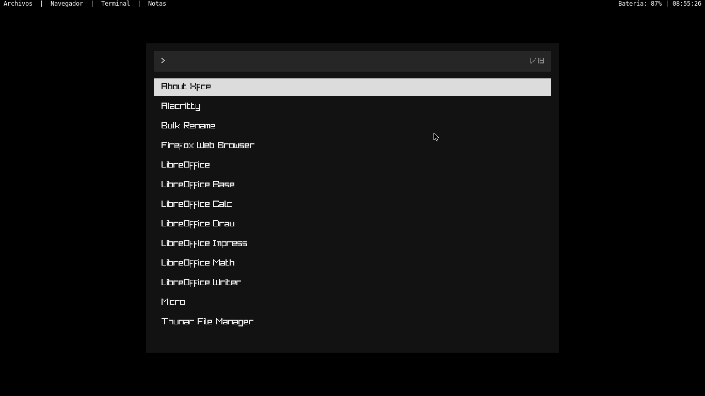
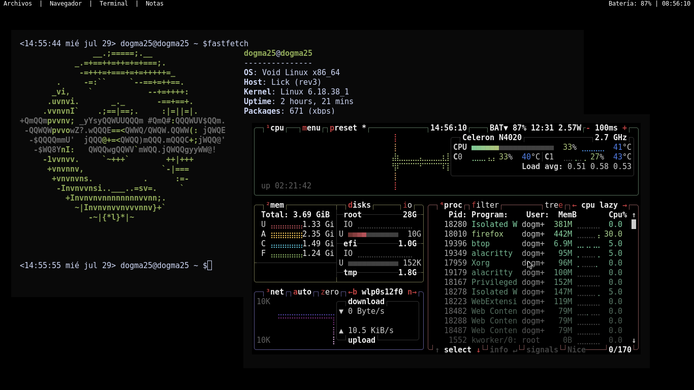

# minix


Un Window Manager minimalista mixto (tiling y floating) para X11 escrito en C++ con un lanzador de aplicaciones desarrollada en c++ y raylib. 

## Requisitos

- compilador de C++ (`g++`)
- X11 librerias de desarrollo (`libx11` en Arch, `libX11-devel` en Void)
- barra lemonbar

## Compilación

### archivo main (el administrador de ventanas)
```bash
g++ main.cpp -o minix -lX11
```

### archivo runner (lanzador de aplicaciones)

```bash
g++ runner.cpp -o runner -lraylib -lGL -lm -lpthread -ldl -lrt -lX11
```

## tutorial

cuando tengas el archivo binario (minix o el nombre que sea) tu lo tienes que poner en el archivo `~/.xinitrc` donde se tiene que ver algo haci

```
#!/bin/sh

#flags

export GTK_USE_PORTAL=0
export QT_NO_PORTAL=1
export MOZ_X11_EGL=1
export XDG_DEACTIVE_PORTALS=1


(sleep 1 && ~/carpeta-repo/barra.sh | lemonbar -p -n lemonbar -g 1366x15+0+0 -f "Monospace:size=9" | xargs -I {} sh -c "{} &") &
# Arrancar el WM

//si lo usas xd
pulseaudio -D &

exec dbus-run-session /home/tu_usuario/carpeta_repo/el_binario
```

te recomiendo que si pongas las flags porque esto ayuda a que no vaya lento

## instalacion de dependencia
en este caso fue desarrollado en void, entonces usaremos `xbps-install` para las instalaciones, cualquier otra cosa deben usar el administrador de paquetes de tu respectiva distribucion

### (obligatorio)instalar lemonbar-xft: 
```
git clone https://github.com/KryptosLogic/lemonbar-xft.git
cd lemonbar-xft
make
sudo make install
```
### (obligatorio)instalar devel-X11:
```
sudo xbps-install -S libX11-devel
```
### (obligatorio/ si usaras el lanzador)instalar raylib:
```
sudo xbps-install -S raylib-devel
```
## atajos

La tecla modificadora principal es **`Alt`** (`Mod1Mask`).

| Atajo | Acción |
| :--- | :--- |
| `Alt + Enter` / `Alt + t` | Abrir la terminal |
| `Alt + r` | Abrir el lanzador de aplicaciones |
| `Alt + c` | Cerrar la ventana activa |
| `Alt + f` | Alternar ventana entre modo flotante y tiling |
| `Alt + 1-9` | Cambiar de espacio de trabajo (workspace) |
| `Alt + Shift + 1-9` | Mover ventana actual a otro espacio de trabajo |
| `Alt + Flecha Arriba` | Subir volumen (+5%) |
| `Alt + Flecha Abajo` | Bajar volumen (-5%) |
| `Alt + m` | Mutear / desmutear el audio |

##Detalles

### lanzardor de aplicaciones
si prefieres usar otro lanzador como rofi o dmenu, te recomiendo que vallas a esta parte del codigo y la cambies por la que prefieras

```
 else if (ev.xkey.keycode == r_code && (ev.xkey.state & Mod1Mask)) {
                    // Usa la ruta absoluta donde está compilado tu lanzador
                    ejecutar_comando("/home/usuario/carpeta-directorio/binario-cargador");
                }
```
esta entre las lineas 440-450

### atajos de sonido

si usas otros drivers como pipewire tienes que cambiar el comando en los atajos esto en estas lineas de codigo

```
if (keysym == XK_Up && (ev.xkey.state & Mod1Mask)) {
                    ejecutar_comando("pactl", "set-sink-volume", "@DEFAULT_SINK@", "+5%");
                }
                else if (keysym == XK_Down && (ev.xkey.state & Mod1Mask)) {
                    ejecutar_comando("pactl", "set-sink-volume", "@DEFAULT_SINK@", "-5%");
                }
                else if (keysym == XK_m && (ev.xkey.state & Mod1Mask)) {
                    ejecutar_comando("pactl", "set-sink-mute", "@DEFAULT_SINK@", "toggle");
                }
```

esta entre la 400-410

